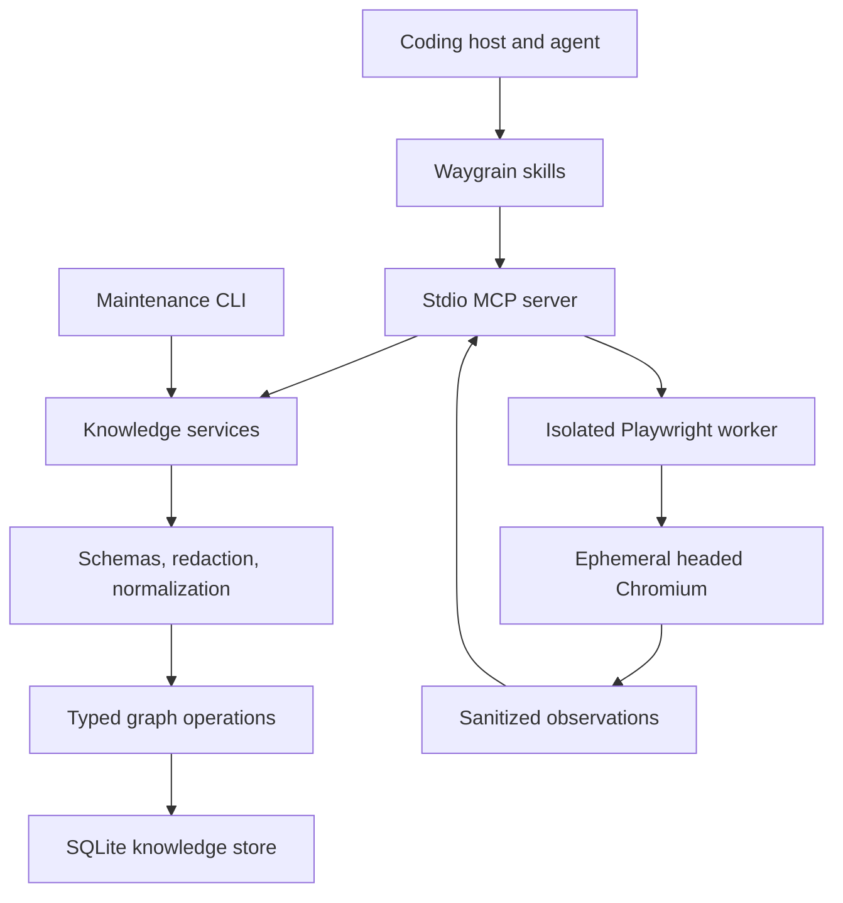
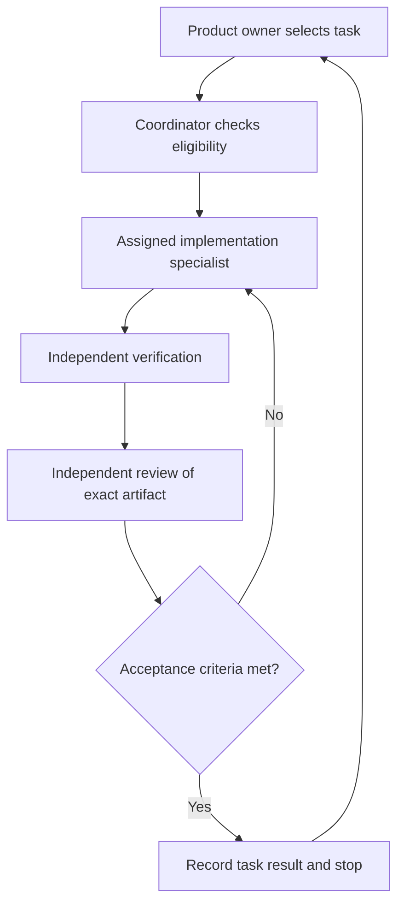

# Waygrain architecture and task-by-task implementation plan

Saved: 6 October 2026. This document records the agreed plan; saving it does not execute or verify an implementation task. Track implementation status in [todo.md](todo.md).

## 1. Direction and stack

Build a standalone local plugin that combines persistent product knowledge with bundled browser capture and agent-directed interaction. The [product specification](https://chatgpt.com/space/page_262002eefff08191b791867eb0eb32f2) remains the baseline; document bundled browser functionality as an explicit amendment.

**Agreed choices:** Blogen with local disposable data; Codex first and Claude Code second on macOS; coordinator with specialist reviews; local pilot followed by gated public packaging; Apache-2.0.

| Area | Choice |
|---|---|
| Runtime | Node.js 24 LTS; Node 26 smoke testing |
| Language/build | Strict TypeScript, ESM, compiler output without bundling |
| MCP | Official `@modelcontextprotocol/server` 2.3.1, stdio |
| Schemas | Zod 4; shared validation, types, and JSON Schemas |
| Database | `better-sqlite3` 13.0.3, parameterized SQL, WAL |
| Browser | Playwright 1.63.0, headed Chromium |
| Tests | Node test runner; Playwright Test for browser scenarios |
| Tooling | npm lockfile, ESLint, Prettier checks, GitHub Actions |

Use one npm package with internal modules. Pin exact versions during foundation setup and record licenses. Playwright’s public JSON accessibility snapshots avoid a text parser; the official MCP SDK’s stable line is v2. [Playwright releases](https://github.com/microsoft/playwright/releases), [MCP SDK releases](https://github.com/modelcontextprotocol/typescript-sdk/releases).

Exclude hosted services, model calls, embeddings, autonomous crawling, dashboards, synchronization, and persistent authentication profiles from v1.

## 2. Architecture and interfaces

### Knowledge core

Keep schemas, normalization, graph operations, persistence, MCP, CLI, and browser integration separate. Core services accept plain JSON and cannot invoke the browser.

Implement the specification’s records, typed relations, evidence classes, trace validation, scope isolation, immutable states, revision guards, idempotency, bounded queries, change detection, and freshness rules.

Retain all seven knowledge tools:

`wg_status`, `wg_ingest`, `wg_commit`, `wg_query`, `wg_evidence`, `wg_changes`, and `wg_plan_refresh`.

Preserve the specified request/response envelopes, limits, stable error codes, and cursor behavior. Partial captures have no state ID; historical flows never silently retarget changed controls.

### Browser component

Add a separately versioned contract with:

`wg_browser_open`, `wg_browser_snapshot`, `wg_browser_navigate`, `wg_browser_act`, `wg_browser_status`, and `wg_browser_close`.

Support click, permitted noncredential fill, select, check/uncheck, scroll, and a small navigation-key allowlist. Exclude arbitrary JavaScript, caller-provided selectors, shell execution, file transfer, and automatic dialog acceptance.

Temporary targets bind to the current session, page, and snapshot. Resolve strict live locators immediately before acting; stale or ambiguous targets require another snapshot.

The workflow is:

**Snapshot → ingest before capture → authorized action → ingest after capture → commit supported trace.**

Generate trace IDs and increasing sequence numbers in the browser component. Store a sanitized attempt marker before action dispatch. Duplicate execution IDs never repeat an action; interrupted attempts can return `unknown`. Application actions and graph writes are not one transaction.

Use manual login in nonpersistent contexts. Never save authentication state, credentials, raw snapshots, screenshots, traces, or input values. Sanitize observations before worker IPC and MCP output. Clean temporary browser resources on shutdown and parent-process loss.

### Configuration, storage, and packaging

Explicit initialization creates project/application IDs, scope aliases, allowed origins, route mappings, versioned redaction profiles, and storage limits. Startup selects an absolute configuration path; tool arguments cannot redirect filesystem writes.

Use one knowledge database per project. A separate SQLite coordination file provides shared lifetime locks for normal processes and exclusive maintenance access for migration/restore. It stores no product evidence.

Provide consistent backup, verified offline restore, archival JSON export, recoverable scoped deletion, and separately previewed permanent purge. Defer JSON import.

Package root `plugin.json`, `mcp.json`, skills, and assets, with a generated Codex compatibility overlay. [Plugin packaging](https://developers.openai.com/plugins/build/plugins).

Ship three skills: **Understand product**, **Explore and remember**, and **Explain changes**. CLI commands cover explicit setup, diagnostics, browser installation, serving, and maintenance. Installation never silently edits host settings or repository ignore rules.

## 3. Development graph and task execution rules

**Execute one selected task per run.** Complete its implementation, checks, and review, record the result, then stop. Do not automatically start the next task or complete an entire stage.

Use these task states:

`pending → in_progress → implemented → verified`

A task can become `blocked` with a concrete reason. Only `verified` satisfies a dependency. Implementation and independent review must refer to the same artifact; later changes invalidate that review.

The task register records each task’s dependencies, authorized scope, acceptance criteria, verification commands, artifact identity, review outcome, and remaining limitations.

Use one implementation writer initially. Assign core, storage, browser, or integration specialists as appropriate. Reviewers cannot approve their own implementation. Commit, push, and publication remain separate explicitly authorized actions.

## 4. Ordered task list

Each row is a separate implementation task. Dependencies enforce ordering; checkpoints are separate read-only acceptance tasks.

### Stage A — Foundation

| ID | Task | Depends on | Acceptance and verification |
|---|---|---|---|
| A01 | Record specification amendment and task register | — | Documents the agreed browser boundary, stack, architecture, and task execution rules; review for consistency with the product spec |
| A02 | Bootstrap package and quality commands | A01 | Apache-2.0 package builds; typecheck, lint, and empty test harness run; dependency versions and licenses recorded |
| A03 | Define explicit configuration and initialization | A02 | Init creates validated project/app configuration and restricted local storage; invalid paths and silent host edits are rejected |
| A04 | Prove packaging and runtime feasibility | A03 | Packed artifact launches stdio, opens SQLite, and launches headed Chromium through explicit setup; retain reproducible smoke results |
| A05 | Define public knowledge and browser contracts | A04 | Versioned strict schemas cover tools, envelopes, errors, limits, and browser attempt states; contract fixtures validate |
| A06 | Foundation checkpoint | A01–A05 | Independent review accepts contracts and packaging evidence; unresolved feasibility issues block later tasks |

### Stage B — Capture and persistence

| ID | Task | Depends on | Acceptance and verification |
|---|---|---|---|
| B01 | Build synthetic UI and privacy fixtures | A06 | Four screens, two roles/environments, modal/tab states, changed UI version, and seeded sensitive values provide deterministic fixtures |
| B02 | Implement redaction and normalization | B01 | Safe structure is deterministic; meaningful order survives; forbidden values disappear before output and persistence |
| B03 | Implement schema and basic transactional store | B02 | Foreign keys, migrations, revisions, busy limits, and maintenance coordination work; failed writes leave no partial records |
| B04 | Implement complete and partial capture ingestion | B03 | Repeated captures preserve history; compatible states reuse identity; partial captures remain fragments; replay has one effect |
| B05 | Expose status and evidence retrieval | B04 | CLI/core/MCP return consistent bounded status and evidence results without leaking rejected values |
| B06 | Capture checkpoint | B01–B05 | Independent tests verify identity, scope separation, redaction, partial coverage, and stored evidence |

### Stage C — Bundled browser

| ID | Task | Depends on | Acceptance and verification |
|---|---|---|---|
| C01 | Implement browser session lifecycle | B06 | Explicit open/status/close owns one headed ephemeral session; manual login works; shutdown and parent-loss cleanup are tested |
| C02 | Implement sanitized structured snapshots | C01 | Public Playwright JSON snapshots map to the ingest schema; raw data stays inside worker memory; unsupported coverage is explicit |
| C03 | Implement current target resolution and navigation | C02 | Allowed navigation works; temporary targets resolve strictly; changed or ambiguous UI cannot use stale targets |
| C04 | Implement bounded browser actions and attempt receipts | C03 | Supported actions work against current targets; credential fields fail closed; duplicate or interrupted attempts cannot silently replay |
| C05 | Browser checkpoint | C01–C04 | Independent browser/privacy review covers redirects, scope changes, cancellation, stale targets, and uncertain outcomes |

### Stage D — Evidence graph and recall

| ID | Task | Depends on | Acceptance and verification |
|---|---|---|---|
| D01 | Implement guarded annotations and identity reconciliation | C05 | Atomic commits preserve provenance, conflicting annotations, supersession history, explicit aliases, and revision conflicts |
| D02 | Implement actions, events, and observed transitions | D01 | Valid before/action/after traces succeed; mismatched scopes, sessions, sequencing, incomplete endpoints, and unrelated visits fail |
| D03 | Implement flows and test-run evidence | D02 | Flows preserve ordered scoped transitions; only matching passed assertions confer test-verified status |
| D04 | Implement lexical search and neighbors | D03 | Ranking is deterministic; scope and tombstones apply; record/byte/hop budgets and stale cursors are explicit |
| D05 | Implement path and flow retrieval | D04 | Bounded traversal excludes inferred edges; unevaluated guards yield conditional paths; incomplete searches remain distinguishable |
| D06 | Recall checkpoint | D01–D05 | Independent review verifies trace integrity, provenance, conditional paths, and bounded queries |

### Stage E — Changes and recovery

| ID | Task | Depends on | Acceptance and verification |
|---|---|---|---|
| E01 | Implement capture and revision comparisons | D06 | Compatible changes cite evidence; incomplete coverage cannot prove removal; incompatible normalizers are explicit |
| E02 | Implement freshness and refresh plans | E01 | Only qualifying new observations advance check times; screen captures do not reverify transitions or entire flows |
| E03 | Implement export, backup, and restore | E02 | Consistent backups preserve IDs/revisions/evidence; exclusive verified restore round-trips query results; JSON export is archival |
| E04 | Implement scoped deletion, undo, purge, and storage cap | E03 | Delete hides only selected scope; undo restores links; purge previews impact; cap rejects ingestion without silently discarding history |
| E05 | Verify concurrency, crash, and migration recovery | E04 | Process tests cover competing writers, killed transactions, failed migrations, future schemas, and live-peer maintenance refusal |
| E06 | Recovery checkpoint | E01–E05 | Independent review accepts durability and maintenance evidence; remaining platform limitations are documented |

### Stage F — Plugin and Blogen pilot

| ID | Task | Depends on | Acceptance and verification |
|---|---|---|---|
| F01 | Package plugin skills and setup workflow | E06 | Three skills, manifests, CLI diagnostics, and explicit browser installation work from a packed artifact |
| F02 | Add Blogen profile and pilot fixtures | F01 | Reviewed label/route rules support synthetic local accounts; Blogen integration requires no core changes or unrelated repository edits |
| F03 | Verify three Blogen journeys | F02 | Browse/filter categories, open/cancel creation, and create a disposable category produce valid scoped evidence |
| F04 | Verify new-session recall in Codex | F03 | A fresh chat explains a feature and retrieves evidence after the original browser session is closed |
| F05 | Verify Claude Code portability on macOS | F04 | Same server/schema works through the second host; setup and unsupported behavior are documented |
| F06 | Pilot checkpoint | F01–F05 | Independent acceptance covers plugin installation, both applications, both hosts, and absence of hidden session assumptions |

### Stage G — Evaluation and release readiness

| ID | Task | Depends on | Acceptance and verification |
|---|---|---|---|
| G01 | Build reproducible evaluation harness | F06 | Matched browser-only, notes-folder, and Waygrain conditions include all overhead and distinguish cold/warm/changed-UI cases |
| G02 | Run efficiency and correctness evaluation | G01 | At least ten tasks with three repetitions per condition; publish distributions, unsupported claims, wrong actions, and failures |
| G03 | Run unfamiliar-developer installation trial | G02 | Three developers attempt install, fixture ingestion, and query within ten minutes; record results and friction |
| G04 | Complete release-readiness review | G03 | Correctness, portability, adoption thresholds, dependency/license inventory, documentation, and packed-artifact checks have truthful verdicts |

**G04 ends at a reviewable release candidate. Publishing npm packages or plugin listings is a later, separately authorized task.**

## 5. Verification gates and defaults

Every implementation task runs focused meaningful tests, typecheck, and build. Run broader suites at checkpoints and whenever shared contracts change.

Release evaluation uses the same browser driver and host/model configuration across all three conditions. Require the specification’s thresholds:

- Warm median browser calls and either wall time or measured tokens improve by at least 20% against the stronger baseline.
- Task success and evidence-grounded correctness do not regress; no additional wrong UI actions.
- Changed UI is detected before obsolete evidence is used.
- Cold-start overhead stays within 15%, or documented repeated-use break-even justifies it.
- Installation trial, second application, and second host pass.
- Missing token measurements remain explicitly unmeasured.

Defaults remain: one headed session per MCP process; manual login; browser launches only on request; external structured ingestion stays supported; 24-hour retrieval freshness policy; specification limits for ingestion, queries, commits, and storage; macOS pilot support without untested cross-platform claims.

**First eligible implementation task: A01.**
